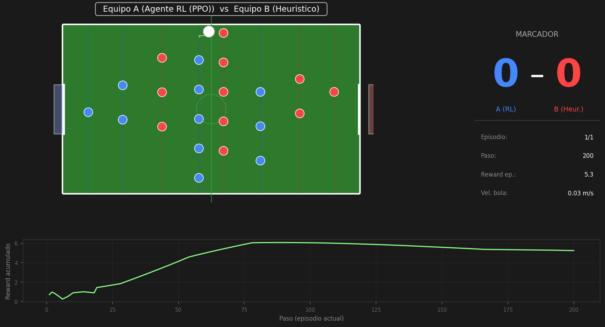

# Futbolín Autónomo — Simulador RL

Simulador de futbolín tipo **Madrid** (estilo español tradicional) diseñado para entrenar agentes de **Reinforcement Learning** y transferirlos a hardware real.




---

## Motivación

El futbolín es un entorno de control con características interesantes para RL:
- Dinámica rápida y no lineal (bola, rebotes, rotación de barras)
- Acción continua en dos ejes (posición lineal + ángulo de rotación)
- Recompensas escasas (gol) complementadas con señales densas
- Sim-to-real: el simulador está diseñado para sustituirse por hardware real sin cambiar el agente

---

## Estructura del proyecto

```
futbolin-autonomo/
├── world.py       — Estado del sistema (bola, barras, campo)
├── physics.py     — Motor de física 2D
├── actuators.py   — Modelo de actuadores (motores reales)
├── reward.py      — Función de recompensa
├── env.py         — Entorno tipo Gymnasium
├── train.py       — Entrenamiento PPO con currículo
├── example.py     — Agente heurístico de referencia
├── models/        — Modelos entrenados (.zip)
└── logs/          — Logs TensorBoard
```

---

## El campo

Basado en el futbolín tipo Madrid:

| Parámetro | Valor |
|---|---|
| Largo | 120 cm |
| Ancho | 68 cm |
| Bola (diámetro) | 35 mm |
| Ancho de portería | 20 cm |
| Barras totales | 8 (4 por equipo) |

### Distribución de barras

```
  [Portería A]                                          [Portería B]
  x=-0.60                                               x=+0.60

  GK-A    DEF-B   ATK-A   MID-B   MID-A   ATK-B   DEF-A   GK-B
  (1j)    (2j)    (3j)    (5j)    (5j)    (3j)    (2j)    (1j)
  -0.50  -0.36   -0.20   -0.05   +0.05   +0.20   +0.36   +0.50
```

Cada barra tiene **dos grados de libertad**:
- **Lineal**: desplazamiento lateral ±7 cm (eje Y)
- **Angular**: rotación completa ±180° (golpeo)

---

## Arquitectura de módulos

### `world.py` — Estado del sistema

Define todos los estados del mundo como dataclasses:

```python
BallState      # x, y, vx, vy
BarState       # linear_pos, angle, linear_vel, angular_vel
FieldConfig    # dimensiones del campo
WorldState     # bola + 8 barras + campo + marcador
```

El vector de observación tiene **36 dimensiones** normalizadas ≈ [-1, 1]:

```
[ball_x, ball_y, ball_vx, ball_vy,  bar0×4, bar1×4, ..., bar7×4]
```

### `physics.py` — Motor de física

| Fenómeno | Modelo |
|---|---|
| Movimiento bola | Integración de Euler, dt=0.02 s |
| Fricción rodante | Decaimiento exponencial (coef. 0.18/s) |
| Rebote en pared | Restitución 0.65 + ruido angular |
| Impacto jugador | Impulso = ω × L × cos(θ) + transferencia vel. lineal |
| Zona de contacto | \|ángulo\| < 60° (pie en posición de golpeo) |
| Detección de gol | Bola cruza la línea dentro del ancho de portería |

El ruido en rebotes e impactos es configurable y reduce el **sim-to-real gap**.

### `actuators.py` — Modelo de motores

Simula la dinámica real de servomotores con **perfil trapezoidal de velocidad**:

| Parámetro | Lineal | Angular |
|---|---|---|
| Recorrido | ±7 cm | ±180° |
| Vel. máxima | 0.8 m/s | ~1.5 giros/s |
| Aceleración máx. | 6 m/s² | 25 rad/s² |
| Ruido posición | ±2 mm | ±1.1° |
| Slippage | 0.5% prob./step | 0.5% prob./step |

El movimiento **no es instantáneo**: el agente debe aprender a anticipar la inercia.

### `reward.py` — Función de recompensa

Diseño por capas para facilitar el aprendizaje:

| Componente | Valor | Tipo |
|---|---|---|
| Gol marcado | +10.0 | Evento |
| Gol recibido | -10.0 | Evento |
| Toque de bola propio | +0.5 | Evento |
| Bola avanzando hacia portería rival | ≤ +0.3/step | Densa |
| Proximidad barra-bola (gaussiana) | ≤ +0.15/step | Densa |
| Penalización por movimiento | -0.02 × \|acción\| | Densa |
| Penalización por jerk | -0.01 × Δacción | Densa |

### `env.py` — Entorno Gymnasium

```python
env = FoosballEnv(
    dt=0.02,              # 50 Hz
    max_steps=750,        # 15 s por episodio
    controlled_team='A',  # equipo controlado por el agente
    opponent='heuristic', # oponente: None | 'heuristic' | objeto propio
    noise=True,           # incertidumbre física activada
)

obs, info   = env.reset()
obs, r, terminated, truncated, info = env.step(action)
```

**Espacio de acción (8 dimensiones, [-1, 1]):**
```
[lin_GK, ang_GK,  lin_ATK, ang_ATK,  lin_MID, ang_MID,  lin_DEF, ang_DEF]
```
Cada par controla la posición lineal y el ángulo de una barra del equipo A.

### Para conectar hardware real

Sobreescribir estos dos métodos en una subclase de `FoosballEnv`:

```python
class HardwareFoosballEnv(FoosballEnv):

    def _apply_agent_commands(self, action):
        # Escribir aquí el comando al driver del motor (serial, CAN, etc.)
        for k, bar_idx in enumerate(self._team_bar_idxs):
            linear_cmd  = float(action[2 * k])
            angular_cmd = float(action[2 * k + 1])
            my_motor_driver.send(bar_idx, linear_cmd, angular_cmd)

    def _get_obs(self):
        # Leer aquí los sensores reales (encoders, cámara, etc.)
        return my_sensor_driver.read_normalized()
```

---

## Entrenamiento RL

### Algoritmo

**PPO** (Proximal Policy Optimization) con red neuronal MLP [256, 256].

### Currículo de 3 fases

El entrenamiento progresa en dificultad para acelerar el aprendizaje:

| Fase | Configuración | Objetivo |
|---|---|---|
| 0 | Sin oponente, sin ruido, 300 pasos | Aprender a tocar la bola |
| 1 | Oponente heurístico, con ruido, 500 pasos | Adaptarse al juego real |
| 2 | Configuración completa, 750 pasos | Juego competitivo |

### Uso

```bash
# Instalar dependencias
pip install stable-baselines3[extra] gymnasium torch

# Entrenar con currículo (recomendado)
python train.py --timesteps 300000 --curriculum

# Entrenar directo sin currículo
python train.py --timesteps 500000

# Más entornos paralelos (más rápido si tienes CPU)
python train.py --timesteps 500000 --n-envs 8 --curriculum

# Evaluar un modelo guardado
python train.py --eval-only models/foosball_ppo_final

# Ver curvas de aprendizaje
tensorboard --logdir logs
```

### Resultados (200k pasos, ~30 min en CPU)

| Métrica | Valor |
|---|---|
| Reward medio/episodio | 38.7 ± 21 |
| Goles marcados/ep | 0.10 |
| Goles recibidos/ep | 0.10 |
| Toques propios/ep | ~5 |

El agente aprendió a competir al nivel del oponente heurístico. Con más pasos (≥1M) y tuning de hiperparámetros se puede mejorar significativamente.

---

## Uso rápido

```python
from env import FoosballEnv
import numpy as np

env = FoosballEnv(dt=0.02, max_steps=750)
obs, _ = env.reset()

for _ in range(750):
    action = env.action_space.sample()         # acción aleatoria
    obs, reward, terminated, truncated, info = env.step(action)
    if terminated or truncated:
        break

print(f"Score: A={info['score']['A']}  B={info['score']['B']}")
```

```python
# Cargar y usar el agente entrenado
from stable_baselines3 import PPO
from env import FoosballEnv

model = PPO.load("models/foosball_ppo_final")
env   = FoosballEnv()
obs, _ = env.reset()

done = False
while not done:
    action, _ = model.predict(obs, deterministic=True)
    obs, r, terminated, truncated, info = env.step(action)
    done = terminated or truncated
```

---

## Dependencias

```
numpy
stable-baselines3[extra]
gymnasium
torch
matplotlib          # opcional, para visualización
```

```bash
pip install stable-baselines3[extra] gymnasium torch matplotlib
```

---

## Próximos pasos sugeridos

- **Más entrenamiento**: 1M+ pasos para superar claramente al heurístico
- **Self-play**: que el equipo B también sea un agente RL que mejora junto al A
- **Observación con cámara**: sustituir la obs. perfecta por detección de bola con visión
- **Múltiples agentes**: un agente por barra en lugar de uno para todo el equipo
- **Hardware real**: implementar `HardwareFoosballEnv` con los drivers del sistema

---

## Licencia

Proyecto de investigación y desarrollo. Uso libre para fines educativos y de investigación.
